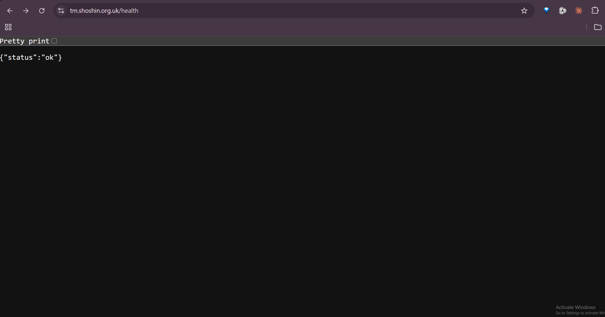
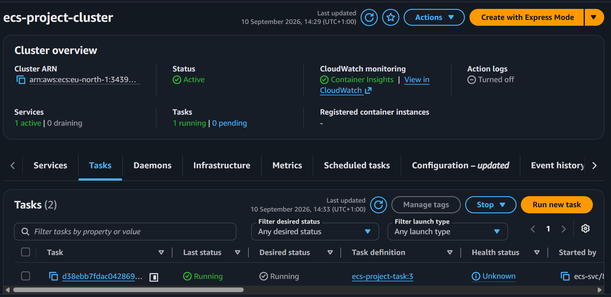
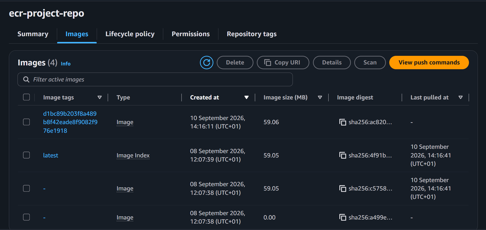
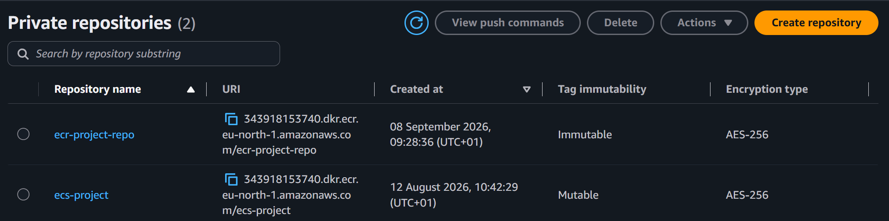
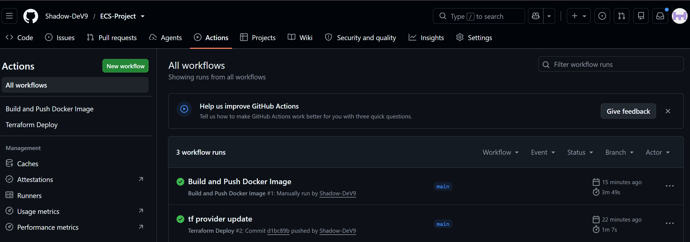

# ECS Project — Containerised Node.js App on AWS Fargate

A production-ready Node.js application deployed on AWS ECS Fargate with full CI/CD automation via GitHub Actions. Infrastructure is provisioned with Terraform, images are stored in ECR, and the app is served over HTTPS via an Application Load Balancer at `https://tm.shoshin.org.uk/health`.

---

## Live Demo

```
GET https://tm.shoshin.org.uk/health
→ {"status":"ok"}
```

---

## Architecture

```
                        ┌─────────────────────────────────────────────┐
                        │                   AWS Cloud                  │
                        │                                             │
  User ──HTTPS──▶  Route53 (tm.shoshin.org.uk)                       │
                        │         │                                   │
                        │         ▼                                   │
                        │   ALB (ecs-project-alb)                     │
                        │   HTTPS:443 → HTTP:3000                     │
                        │   ACM Certificate (shoshin.org.uk)          │
                        │         │                                   │
                        │         ▼                                   │
                        │   ECS Fargate Cluster                       │
                        │   (ecs-project-cluster)                     │
                        │         │                                   │
                        │         ▼                                   │
                        │   ECS Service (ecs-project-service)         │
                        │   Task: Node.js app on port 3000            │
                        │   Image pulled from ECR                     │
                        │                                             │
                        │   ECR (ecr-project-repo)                    │
                        │   Docker images tagged by commit SHA        │
                        │                                             │
                        │   VPC → Public Subnets (eu-north-1)         │
                        └─────────────────────────────────────────────┘

GitHub Actions ──OIDC──▶ AWS IAM Role ──▶ ECR + ECS + Terraform
```

---

## Tech Stack

| Layer | Technology |
|-------|-----------|
| Application | Node.js + Express |
| Containerisation | Docker (multi-stage, distroless) |
| Registry | Amazon ECR |
| Compute | Amazon ECS Fargate |
| Load Balancer | AWS ALB (HTTPS) |
| TLS Certificate | AWS ACM |
| DNS | AWS Route53 |
| Networking | AWS VPC, Public Subnets |
| Infrastructure as Code | Terraform (modular) |
| CI/CD | GitHub Actions |
| Auth (no static keys) | OIDC + IAM Role |
| Terraform State | S3 Backend |
| Region | eu-north-1 (Stockholm) |

---

## Project Structure

```
ECS-Project/
├── app/
│   ├── server.js          # Express app with /health route
│   ├── Dockerfile         # Multi-stage distroless build
│   ├── package.json
│   └── package-lock.json
├── terraform/
│   ├── main.tf            # Root module — wires all modules together
│   ├── provider.tf        # AWS provider + S3 backend config
│   └── modules/
│       ├── vpc/           # VPC, subnets, internet gateway
│       ├── ecr/           # ECR private repository
│       ├── alb/           # Application Load Balancer + target group
│       ├── ecs/           # ECS cluster, service, task definition
│       ├── acm/           # ACM TLS certificate
│       └── route53/       # DNS records + ACM validation
└── .github/
    └── workflows/
        ├── docker-build-push.yml   # CI/CD — build & deploy app
        └── terraform-deploy.yml    # CI/CD — infrastructure changes
```

---

## Application

The app is a minimal Node.js/Express server with a single health check endpoint:

```js
app.get("/health", (req, res) => {
  res.json({ status: "ok" });
});
```

### Dockerfile — Multi-stage Distroless Build

```dockerfile
# Stage 1: Builder
FROM node:22-alpine AS builder
WORKDIR /app
COPY package*.json ./
RUN npm ci --only=production
COPY . .

# Stage 2: Runtime (distroless — no shell, no package manager, minimal attack surface)
FROM gcr.io/distroless/nodejs22-debian12
WORKDIR /app
COPY --from=builder /app/node_modules ./node_modules
COPY --from=builder /app/server.js ./
EXPOSE 3000
CMD ["server.js"]
```

**Why distroless?**
- No shell — attackers can't exec into the container
- No package manager — nothing to exploit
- Runs as non-root user (65532) by default
- ~59MB image size

---

## Infrastructure (Terraform)

Infrastructure is split into 6 modules:

| Module | What it creates |
|--------|----------------|
| `vpc` | VPC, 2 public subnets, internet gateway, route tables |
| `ecr` | Private ECR repository with tag immutability |
| `alb` | ALB, HTTPS listener (443), HTTP→HTTPS redirect, target group |
| `acm` | TLS certificate for `shoshin.org.uk` with DNS validation |
| `route53` | A record for `tm.shoshin.org.uk` pointing to ALB |
| `ecs` | Fargate cluster, task definition, service, CloudWatch logs, IAM roles |

### Terraform State

State is stored remotely in S3 so both local development and GitHub Actions share the same state:

```hcl
backend "s3" {
  bucket = "ecs-project-terraform-state-343918153740"
  key    = "terraform.tfstate"
  region = "eu-north-1"
}
```

---

## CI/CD Pipelines

### Authentication — OIDC (No Static AWS Keys)

GitHub Actions authenticates with AWS using **OpenID Connect** — no AWS access keys are stored anywhere. Instead:

1. GitHub generates a short-lived OIDC token for each workflow run
2. AWS validates the token against the GitHub OIDC provider
3. GitHub Actions assumes the `github-actions-oidc-role` IAM role
4. The role has only the permissions it needs (ECR, ECS, S3, Terraform)

```yaml
- name: Configure AWS credentials via OIDC
  uses: aws-actions/configure-aws-credentials@v4
  with:
    role-to-assume: ${{ secrets.AWS_ROLE_ARN }}
    aws-region: ${{ env.AWS_REGION }}
```

### Pipeline 1 — Docker Build & Push (`docker-build-push.yml`)

**Triggers:** Push to `main` with changes in `app/` — or manually via `workflow_dispatch`

```
Checkout → Configure AWS (OIDC) → Login to ECR → Build & Push Image → Force ECS Redeploy → Health Check
```

- Image is tagged with the **Git commit SHA** (e.g. `d1bc89b203f8a489...`) — every deploy is traceable
- Forces ECS to pull the new image and redeploy
- Waits for ECS to stabilise then hits `https://tm.shoshin.org.uk/health` to confirm success

### Pipeline 2 — Terraform Deploy (`terraform-deploy.yml`)

**Triggers:** Push to `main` with changes in `terraform/` — or manually via `workflow_dispatch`

```
Checkout → Configure AWS (OIDC) → Setup Terraform → terraform init → terraform plan → terraform apply
```

- Reads state from S3 backend so it knows what already exists
- `terraform plan` shows what will change before applying
- `terraform apply -auto-approve` applies the changes

---

## GitHub Secrets Required

| Secret | Description |
|--------|-------------|
| `AWS_ROLE_ARN` | ARN of the `github-actions-oidc-role` IAM role |

---

## Screenshots

### App live at `https://tm.shoshin.org.uk/health`


### ECS Cluster — 1 task running


### ECR Repository — images tagged by commit SHA


### ECR Private Repositories


### GitHub Actions — Both pipelines passing


---

## How to Deploy From Scratch

### Prerequisites
- AWS CLI configured
- Terraform installed
- Docker installed
- GitHub repo with `AWS_ROLE_ARN` secret set

### 1 — Create S3 state bucket (one time only)
```bash
aws s3api create-bucket \
  --bucket ecs-project-terraform-state-343918153740 \
  --region eu-north-1 \
  --create-bucket-configuration LocationConstraint=eu-north-1

aws s3api put-bucket-versioning \
  --bucket ecs-project-terraform-state-343918153740 \
  --versioning-configuration Status=Enabled
```

### 2 — Deploy infrastructure
```bash
cd terraform
terraform init
terraform apply
```

### 3 — Build and push Docker image
```bash
cd app
docker build -t <ecr-repo-url>:latest .
docker push <ecr-repo-url>:latest
```

### 4 — Push to GitHub to trigger CI/CD
```bash
git push origin main
```
Any push to `main` with changes in `app/` triggers the Docker pipeline. Changes in `terraform/` trigger the Terraform pipeline.

---

## Key Design Decisions

**Why Fargate?** No EC2 instances to manage — AWS handles the underlying compute. You pay per task, not per server.

**Why distroless?** Minimal attack surface. No shell means even if an attacker gets code execution they can't do much with it.

**Why OIDC instead of access keys?** Access keys are long-lived secrets that can leak. OIDC tokens are short-lived (15 minutes) and scoped to a specific repo and branch — much safer.

**Why S3 backend?** Terraform state must be shared between local development and GitHub Actions. S3 is durable, versioned, and accessible from anywhere with the right IAM permissions.

**Why commit SHA image tags?** Using `:latest` means you can never tell which version is running. Commit SHAs make every deployment traceable back to the exact code that was deployed.
